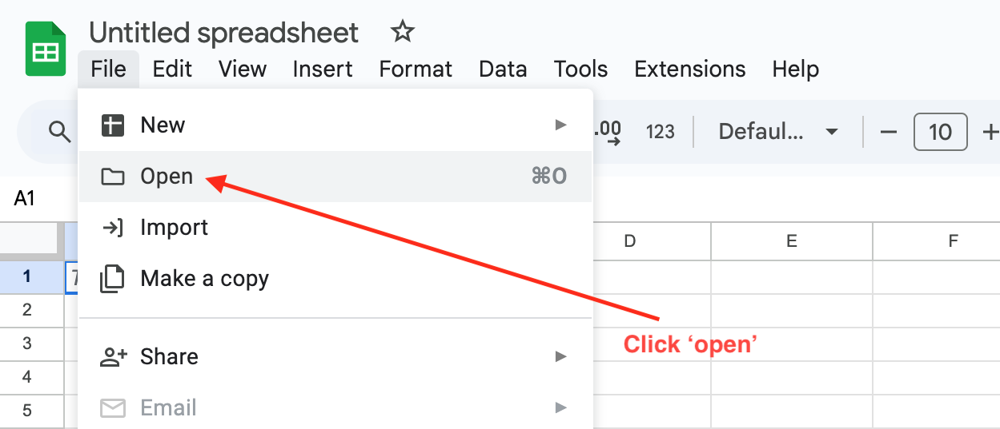
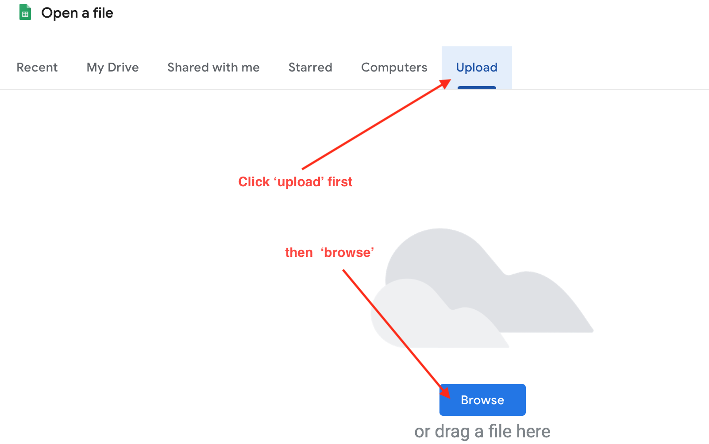
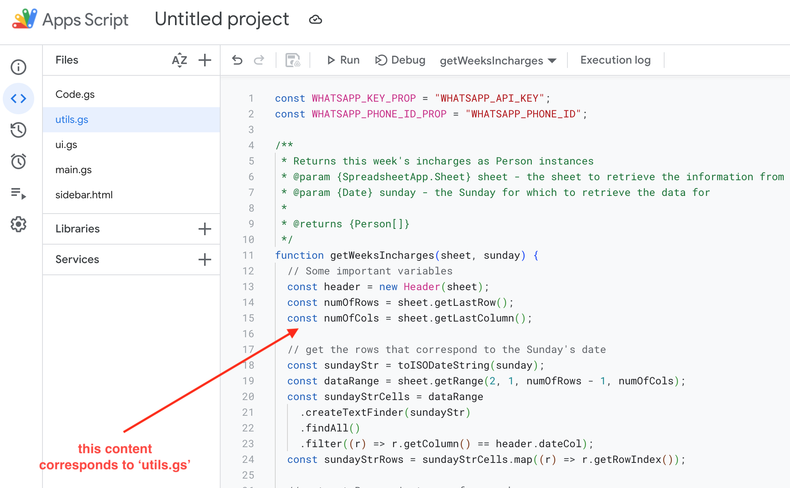
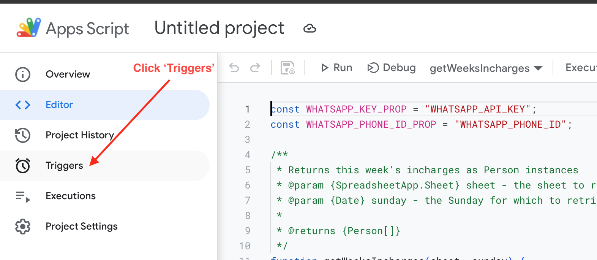

# FisherCreek Scheduler

This is the Google App Script code for the schedule manager for Fisher's Creek Church, Gothenburg Sweden.

## Prerequisites

| Prerequisite                                  | Details                                                                                                                                                                                                                                                                                                                                                                                                                                                                                                                                                                                                                                                                                                                 |
| --------------------------------------------- | ----------------------------------------------------------------------------------------------------------------------------------------------------------------------------------------------------------------------------------------------------------------------------------------------------------------------------------------------------------------------------------------------------------------------------------------------------------------------------------------------------------------------------------------------------------------------------------------------------------------------------------------------------------------------------------------------------------------------- |
| Google account                                | The script runs on the Google docs platform.   You therefore need a [Gmail account](https://mail.google.com/) to use it.                                                                                                                                                                                                                                                                                                                                                                                                                                                                                                                                                                                            |
| ['Year Planner'](./Year%20Planner.xlsx) sheet | The example sheet itself is [Year Planner](./Year%20Planner.xlsx).  You however have to upload it to [Google Sheets](https://docs.google.com/spreadsheets)   first in order for it to work.   **Be sure to have both your spreadsheet and appscript using   the UTC (GMT no daylightsaving) timezone. See the [docs](https://developers.google.com/apps-script/reference/base/session#getscripttimezone).**                                                                                                                                                                                                                                                                                         |
| WhatsApp API access                           | Access to the [WhatsApp Business Platform API](https://business.whatsapp.com/developers/developer-hub/),   as you will need an API key and a phone number ID.    **You will need to also create the "ministry_reminder"   template message in the WhatsApp API dashboard.   See [these instructions](https://www.facebook.com/business/help/2055875911147364?id=2129163877102343)**    **Your API key (access token) needs to be permanent.   The default one supplied is for short sessions.   [Here](https://developers.facebook.com/docs/whatsapp/business-management-api/get-started#1--acquire-an-access-token-using-a-system-user-or-facebook-login) are the instructions.**. |

## Quick Start

- Download and extract this repository.

    <!--  -->

- Create a [Gmail account](https://mail.google.com/) if you have not yet already.
- Create a new blank [Google sheet](https://docs.google.com/spreadsheets)

  

- Click the **File** > **Open** menu links in that order.

  

- Click the **Browse** button in the **Upload** tab

  

- Select the 'Year Planner.xlsx' that is on the root of this folder.

- Click **Extensions** > **Apps Script** menu links.

  **The Apps scripts editor might fail to open if you are signed into multiple Gmail accounts.**

  **Try to copy and paste the sheet's URL into an incognito window.**

  **You will be prompted to sign into one Gmail account.**

  

- Create the following files by clicking the `+` on in the `Files` section:

  - `main.gs`
  - `sidebar.html`
  - `ui.gs`
  - `utils.gs`

    

- Copy and paste the contents of the following files from this repository to the corresponding file in the 'Apps Scripts' editor.

  - `main.gs`
  - `sidebar.html`
  - `ui.gs`
  - `utils.gs`

    **Make sure you save (i.e Ctrl-S) after every paste**

    

- Open the triggers screen in the 'Apps Scripts' editor.

  

- Click 'Add Trigger'

  

- Select 'onOpen' function and click 'Save'. Click through any authorizations that follow.

  

- Click 'Add Trigger' again

  

- Select 'main' function.

  - Select the 'Time-driven' event source
  - Select the 'Week timer' trigger type
  - Select 'Every Monday' in the day of week
  - Click 'Save'
  - Click through any authorizations that follow.

    

- Reload your Google sheet. A new menu section 'Fishers creek' must be visible.

  

- A sidebar should also be showing.

  

- Email alerts can now work as long as the email column in the sheet table has a valid email or lists of comma-separated emails.

- In order to send WhatsApp messages, you will need both an **API key (Access token)** and a **Phone ID**. Find more details at the Meta developer docs:

  - [WhatsApp cloud API getting started](https://developers.facebook.com/docs/whatsapp/cloud-api/get-started).
  - [Access tokens / API keys](https://developers.facebook.com/docs/whatsapp/business-management-api/get-started#system-users)
  - [Message templates](https://developers.facebook.com/docs/whatsapp/message-templates/guidelines)

<!-- ## License

Licensed under the [MIT License](LICENSE)-->

## Acknowledgements

All glory belongs to God.

> I am the vine, you are the branches.  
> He who abides in Me, and I in him,  
> bears much fruit;  
> for without Me you can do nothing.
>
> -- John 15: 5
